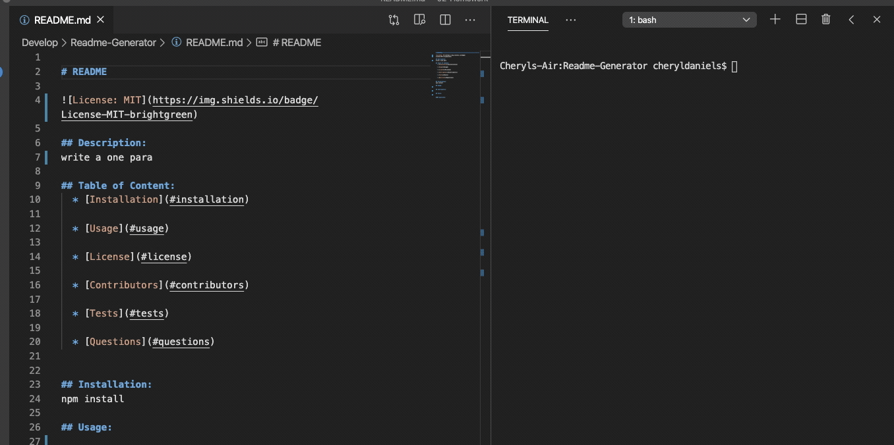

# README

## Description: 
project description goes here.

## Table of Content:
  * [Installation](#installation)

  * [Usage](#usage)

  * [License](#license)

  * [Contributors](#contributors)

  * [Tests](#tests)

  * [Questions](#questions)

## Installation:
npm install

## Usage:
use examples 

## Contributors:
Cheryl Daniels

## Tests:
none

#### Questions:

